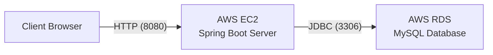

# 📂 파일 확장자 차단 과제 (File Extension Blocker)

## 🛠️ 1. 사용한 프레임워크 및 언어 (Tech Stack)

### 🔹 기술 스택
| 구분 | 기술 (Version) |
| --- | --- |
| **Language** | Java 21 |
| **Framework** | Spring Boot 3.5.10 |
| **Database** | MySQL 8.0 (AWS RDS), H2 (Local) |
| **ORM** | Spring Data JPA |
| **Frontend** | JSP, JavaScript, jQuery |
| **Infrastructure** | AWS EC2 (Ubuntu), AWS RDS |
| **Build Tool** | Maven |

### 🔹 기술 선정 이유
 - Java 21 & Spring Boot 3.5.10 : 두번의 팀 프로젝트로 단련된 언어와 프레임워크를 사용하여 개발 시간 단축과 객체지향적인 설계가 가능하기 때문에 선택했습니다.
 - JPA : 1인 개발 프로젝트이기 때문에 개발 시간 단축과 객체 중심의 테이블 설계가 가능해 스프링부트 중심 아키텍쳐 설계가 가능하기 때문에 선택했습니다.
 - MySQL(AWS RDS) : 처음에는 Oracle 11g로 설계하였으나 AWS RDS에서는 너무 무겁고 Oracle 소프트웨어 사용료가 발생할 수도 있기 때문에 같은 관계형 데이터베이스인 MySQL로 선회하여 진행하였습니다.
 - AWS EC2 & RDS : 애플리케이션 서버와 데이터베이스 서버를 분리하고 개발하여 확장성과 편의성을 높였습니다.
<br>

---

## 🏗️ 2. 구현 구조 (Implementation)

### 🔹 디렉토리 구조
```text
src/main/java/com/example/assignment
├── controller  # 요청 처리 (ExtensionController)
├── service     # 비즈니스 로직 (ExtensionService)
├── repository  # DB 접근 (ExtensionRepository)
├── entity      # DB 테이블 매핑 (Extension)
└── dto         # 데이터 전송 객체
```

### 해당 구조로 구현한 이유
#### 계층형 아키텍쳐 :
 - controller는 요청 및 응답
 - Service는 트랜잭션 관리와 비즈니스 로직을 담당
 - Repository는 데이터 접근(DAO의 기능)
 - Entity는 데이터베이스 테이블 스키마를 객체로 정의
 - 각 계층의 역할을 분리하여 유지보수성을 높였습니다.

## 🗂️ 3. 데이터베이스 설계 (Database Schema)

### 🔹 테이블 구조 (ERD)
| 컬럼명 | 타입 | 제약조건 | 설명 |
| --- | --- | --- | --- |
| id | BIGINT | PK, Auto Increment | 고유 식별자 (ID) |
| name | VARCHAR(255) | Unique, Not null | 확장자 이름 (예: bat, exe) |
| type | VARCHAR(255) | Not null | 확장자 유형 (FIXED / CUSTOM) |
| created_at | TIMESTAMP | - | 생성 일시 (최신순 정렬용) |

### 🔹 그렇게 설계한 이유
- 무결성 : name에 Unique 제약조건을 걸어서 중복된 데이터가 저장되는 것을 방지하였습니다.
- 상태 관리 : 체크여부(Y/N)를 테이블에 저장하는 것이 아닌 데이터베이스에 존재하면 삭제, 존재하지 않으면 저장하는 방식으로 단순화하여서 최적화하였습니다.
- UX : created_at 칼럼을 추가하여 사용자가 방금 추가한 확장자가 리스트의 최상단에 위치하도록 정렬 기준을 생성하였습니다.

## 🏛️ 4. 아키텍처 구조 (Architecture)
### 🔹 배포 아키텍처


###🔹 그렇게 설계한 이유
 - 애플리케이션 서버와 데이터베이스 서버를 분리하고 개발하여 확장성관 편의성을 높였습니다.클라우드 환경을 통해 어디서든 접근 가능하도록 구성했습니다.

## 💻 5. 결과 (Result)
### 🔹 실행 화면
<p align="center">
  
</p>

### 🔹 커스텀 확장자 등록 화면
<p>
  
  &nbsp;&nbsp;
  
</p>

### 🔹 중복 방지 화면
<p>
  
</p>

### 🔹 삭제 화면
<p>
  
  &nbsp;&nbsp;
  
</p>

### 🔹 배포 주소
URL: http://15.134.179.246:8080

### 🔹 기능 구현 및 추가 고려 사항
 - 고정 확장자
   - 체크박스 선택 시 DB 저장 및 차단 (새로고침 시 유지)
 - 커스텀 확장자
   - 등록 개수 제한 : 최대 200개까지 추가 가능
   - 중복 입력 방지 : 중복 저장 방지를 위해 이중 검증
   - 입력 유효성 검사: 최대 20자까지만 입력 가능하도록 제한하고, 입력값의 공백(Trim)을 제거하여 저장합니다.
 - 최신순 정렬
   - 사용자가 방금 추가한 확장자가 리스트의 최상단에 위치하도록 정렬 기준 생성
